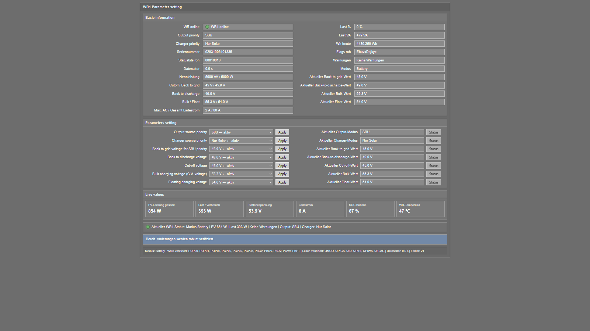
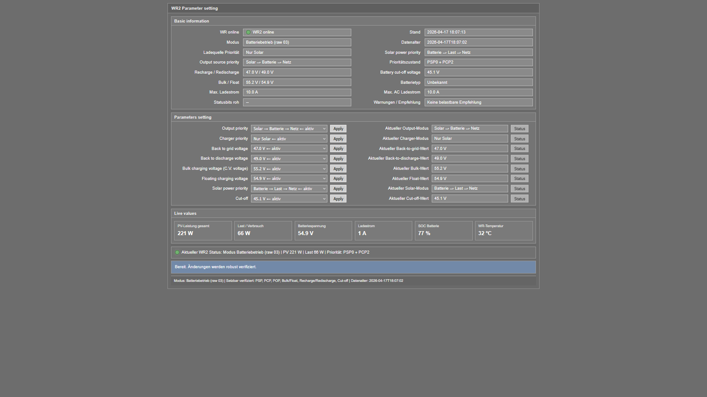

# Raspberry Pi Inverter Auto-Setup for PI30 / PI18

Auto-setup project for Raspberry Pi inverter monitoring and control with **WatchPower-like** and **SolarPower-like** workflows.

This project helps set up **PI30 / WR1** and **PI18 / WR2** inverter environments on **Raspberry Pi** with **MQTT**, **systemd**, and either a **built-in UI** or an **external UI**.

## Features

- Supports **PI30 / WR1**
- Supports **PI18 / WR2**
- **MQTT** integration
- Generates **systemd** service files
- Supports **built-in UI**
- Supports **external UI**
- Creates installer configuration and activation commands
- Uses device-based service names
- Consistent `latest_json` handling from installer to builder services

## UI Preview

### WR1 / PI30 UI



### WR2 / PI18 UI



## Project Structure

- **PI30 / WR1** → `watchpower-like`
- **PI18 / WR2** → `solarpower-like`

## Quick Start

### PI30 / WR1

```bash
python3 setup_pi30.py
```

### PI18 / WR2

```bash
python3 setup_pi18.py
```

## Installer Flow

The installers ask for:

- device / USB port
- device name
- MQTT on/off
- MQTT host / port / username / password
- poll interval
- UI target directory
- UI mode
  - built-in
  - external
- UI port for built-in mode

## Current Status

Verified in isolated test runs:

- built-in mode for PI30 and PI18
- external mode for PI30 and PI18
- service slug generation from device name
- reader / builder / timer service generation
- UI service only for built-in mode
- installer command script generation without automatic execution
- consistent `latest_json` handling from installer to builder services

## latest_json Handling

The current project logic uses device-based latest JSON files:

- readers write to `/home/pi/wr-logs/<device_name>_latest.json`
- builders receive that path through `Environment=LATEST_JSON=...`
- state builders keep a fallback to `WR1_latest.json` and `WR2_latest.json`

## Why this project

This repository is useful if you are searching for:

- **WatchPower Raspberry Pi**
- **SolarPower Raspberry Pi**
- **PI30 MQTT Raspberry Pi**
- **PI18 inverter Raspberry Pi**
- **Raspberry Pi inverter auto-setup**
- **systemd inverter monitoring**

## Repository

Source code and installer files are available in this GitHub repository.
